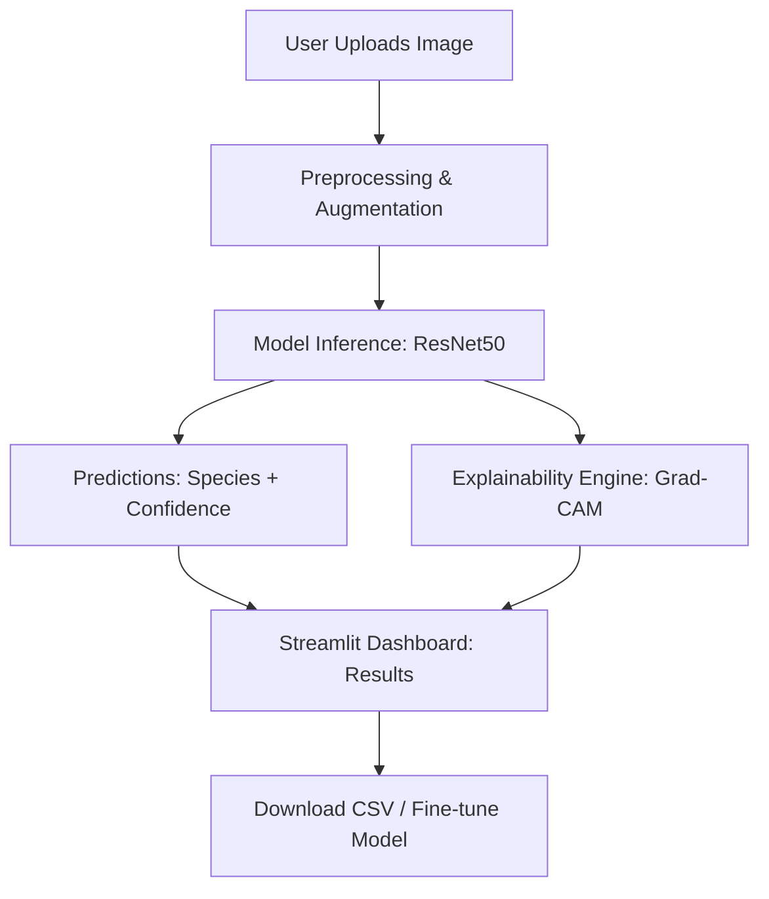
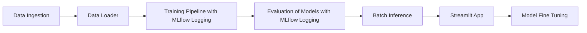

# 🦉 EcoClassify – Wildlife Image Classifier  


> **AI-powered wildlife conservation.**  
EcoClassify is an **end-to-end computer vision project** that classifies camera trap images into wildlife species using **transfer learning (ResNet50).**  
It includes **model explainability (Grad-CAM)**, **batch inference**, **fine-tuning via Streamlit UI**, and **MLflow/DagsHub integration** for experiment tracking. It was born out of the need to help researchers, educators, and nature lovers quickly identify species without needing to be a machine learning wizard. This project was developed as part of my internship at **Euron**, with heartfelt thanks to **Sudhanshu Kumar, CEO of Euron,** for his guidance and mentorship.

🔗 **Live Demo on Hugging Face**: [](https://huggingface.co/spaces/santosh3110/Ecoclassify-Wildlife_Classifier)

---

## 📸 App Screenshots  

| Inference (Single Image) | Grad-CAM Explainability |
|---------------------------|--------------------------|
|  |  |  

| Batch Inference | Fine-Tuning |
|-----------------|-------------|
|  |  |  

---

## 📖 Table of Contents  

1. [About](#-about)  
2. [Features](#-features)  
3. [Architecture](#-architecture)  
4. [Dataset](#-dataset)  
5. [Installation](#-installation)  
6. [Usage](#-usage)  
7. [Streamlit App](#-streamlit-app)  
8. [Training & Evaluation](#-training--evaluation)  
9. [Explainability](#-explainability)  
10. [Batch Inference](#-batch-inference)  
11. [Fine-Tuning](#-fine-tuning)  
12. [Design Docs](#-design-docs)  
13. [Results](#-results)  
14. [Future Work](#-future-work)  
15. [Acknowledgements](#-acknowledgements)  

---

## 🌍 About  

Camera traps capture **millions of images** in wildlife conservation projects. Manual classification is slow, error-prone, and not scalable.  

**EcoClassify** provides:  
- 🔬 Automated **species classification** (7 classes + Blank).  
- 🖼️ **Explainability dashboard** (Grad-CAM heatmaps).  
- ⚡ **Batch inference** for CSV/ZIP datasets.  
- 🎛️ **Fine-tuning** interface for custom datasets.  
- 📊 **MLflow/DagsHub** experiment logging.  

---

## 🚀 Features  

- ✅ Species classification: *Antelope_Duiker, Bird, Civet_Genet, Hog, Leopard, Monkey_Prosimian, Rodent, Blank*.  
- ✅ **Transfer learning** with ResNet50 backbone.   
- ✅ **Grad-CAM** explainability for predictions.  
- ✅ **Streamlit app** with multiple tabs: Inference, Batch, Fine-tuning.  
- ✅ **Config-driven training** (YAML params & config).  
- ✅ **Experiment tracking** with MLflow + DagsHub.  

---

## 🏗️ Architecture  

### System Architecture  



### End-to-End Pipeline  



### Project Structure  

```
.
EcoClassify---Wildlife-Image-Classifier/
│
├── app.py                     # Streamlit app entry point
├── main.py                    # Orchestrates full training → eval → inference pipeline
├── setup.py                   # Package setup
├── requirements.txt           # Dependencies
├── README.md                  # Documentation
├── LICENSE
├── colab_code.ipynb           # Code for running the repo on Google Colab
├── params.yaml                # Hyperparameters
├── init_project_structure.py  # Script to bootstrap project tree
│
├── artifacts/                 # All experiment outputs
│   ├── base_model/            # Initial CNN model
│   ├── resnet50_model/        # ResNet50 base model
│   ├── training/              # Trained model checkpoints
│   ├── prepare_callbacks/     # Callback checkpoints
│   ├── evaluation/            # Confusion matrices & reports
│   ├── explanations/          # Grad-CAM heatmaps
│   ├── batch_inference/       # Batch predictions
│   ├── data_ingestion/        # Raw & processed datasets
│   └── streamlit_outputs/     # Models & mappings saved from app
│
├── config/
│   └── config.yaml            # Centralized config file
│ 
├── docs/                      # Project Documents
│   ├── PRD.pdf                # Product Requirements & Specification Document
│   ├── HLD.pdf                # High Level Design Document
│   └── LLD.pdf                # Low Level Design Document
│
├── logs/
│   └── running_logs.log       # Pipeline logs
│
├── research/                  # Notebooks for experiments
│   └── experiment.ipynb
│   
│
└── src/ecoclassify/           # Source code (modular package)
    ├── components/            # Core ML components
    │   ├── customcnn_base_model.py
    │   ├── resnet50_model.py
    │   ├── training.py
    │   ├── evaluation.py
    │   ├── explanation_generator.py
    │   ├── fine_tuning.py
    │   ├── batch_inference.py
    │   ├── data_ingestion.py
    │   └── data_loader.py
    │
    ├── pipeline/              # Orchestrated stages
    │   ├── stage_01_data_ingestion.py
    │   ├── stage_02_customcnn_base_model.py
    │   ├── stage_03_resnet_50_model.py
    │   ├── stage_04_model_training.py
    │   ├── stage_05_model_evaluation.py
    │   ├── stage_06_generate_explanations.py
    │   └── stage_07_batch_inference.py
    │
    ├── config/                # Config manager
    │   └── configuration.py
    │
    ├── constants/             # File paths & constants
    │   └── paths.py
    │
    ├── entity/                # Config/data entities
    │   └── config_entity.py
    │
    ├── utils/                 # Utility functions
    │   ├── common.py
    │   └── logger.py
    │
    └── __init__.py
```

---

## 📚 Dataset  

- **Source**: Conser-vision Practice Area: Image Classification by drivendata.org
- **Provided by**:  
  *The Pan African Programme: The Cultured Chimpanzee, Wild Chimpanzee Foundation, DrivenData. (2022). Conser-vision Practice Area: Image Classification. Retrieved [July 12 2025] from https://www.drivendata.org/competitions/87/competition-image-classification-wildlife-conservation/.*  

---

## ⚙️ Installation  

```bash
git clone https://github.com/santosh3110/EcoClassify---Wildlife-Image-Classifier.git
cd EcoClassify---Wildlife-Image-Classifier
conda create -n ecoclassify python=3.10 -y
conda activate ecoclassify
pip install -r requirements.txt
```

(Optional: install PyTorch with CUDA if using GPU).  

---

## ▶️ Usage  

### Run Streamlit App  

```bash
streamlit run app.py
```

App opens at **http://localhost:8501**.  

### CLI Training  

```bash
python ecoclassify/pipelines/main.py
```

---

## 🖥️ Streamlit App  

👉 Try EcoClassify directly without setup: [Live Demo on Hugging Face 🚀](https://huggingface.co/spaces/santosh3110/Ecoclassify-Wildlife_Classifier)

Tabs available:  

1. **About** – Project info, dataset, motivation.  
2. **Inference** – Upload images → classification + Grad-CAM heatmaps.  
3. **Batch Inference** – Upload CSV + ZIP → get predictions CSV.  
4. **Fine-Tuning** – Upload dataset (train/val) → retrain ResNet50 with custom hyperparameters.  

---

## 📊 Model Training & Evaluation  

- Models trained:  
  - **CustomCNN** (100 epochs)  
  - **ResNet50 (transfer learning)** (50 epochs)  

- Evaluation scope:
  - Confusion matrix
  - Classification report
  - Calibration metrics (temperature scaling)
  - **Artifacts** stored under artifacts/

### Results Summary

| Model     | Temperature | Uncalibrated Accuracy | Calibrated Accuracy | Uncalibrated Precision | Calibrated Precision | Uncalibrated Recall | Calibrated Recall | Uncalibrated F1 | Calibrated F1 | Uncalibrated Log-Loss | Calibrated Log-Loss |
|:----------|:-----------:|:---------------------:|:-------------------:|:----------------------:|:--------------------:|:--------------------:|:-------------------:|:----------------:|:----------------:|:----------------------:|:----------------------:|
| CustomCNN | 0.66        | 0.70                  | 0.70                | 0.70                   | 0.70                 | 0.70                 | 0.70                | 0.69             | 0.69          | 0.89                   | 0.83                   |
| ResNet50  | 0.82        | 0.89                  | 0.89                | 0.89                   | 0.89                 | 0.89                 | 0.89                | 0.89             | 0.89          | 0.41                   | 0.39                   |

### Macro & Weighted Averages

| Model     | Macro Precision | Macro Recall | Macro F1 | Weighted Precision | Weighted Recall | Weighted F1 |
|:----------|:----------------:|:------------:|:--------:|:------------------:|:---------------:|:-----------:|
| CustomCNN | 0.72            | 0.70         | 0.71     | 0.70               | 0.70            | 0.69       |
| ResNet50  | 0.90            | 0.90         | 0.90     | 0.89               | 0.89            | 0.89       |

### Per-class Metrics

### CustomCNN

| Class            | Precision | Recall | F1-score | Support |
|:-----------------:|:---------:|:------:|:--------:|:-------:|
| antelope_duiker  | 0.50      | 0.50   | 0.50     | 495.00  |
| bird             | 0.75      | 0.69   | 0.72     | 328.00  |
| blank            | 0.62      | 0.36   | 0.46     | 443.00  |
| civet_genet      | 0.80      | 0.92   | 0.86     | 485.00  |
| hog              | 0.92      | 0.79   | 0.85     | 195.00  |
| leopard          | 0.91      | 0.87   | 0.89     | 451.00  |
| monkey_prosimian | 0.57      | 0.79   | 0.66     | 498.00  |
| rodent           | 0.69      | 0.70   | 0.70     | 403.00  |

### ResNet50

| Class            | Precision | Recall | F1-score | Support |
|:-----------------:|:---------:|:------:|:--------:|:-------:|
| antelope_duiker  | 0.81      | 0.81   | 0.81     | 495.00  |
| bird             | 0.93      | 0.96   | 0.95     | 328.00  |
| blank            | 0.77      | 0.62   | 0.68     | 443.00  |
| civet_genet      | 0.94      | 0.97   | 0.96     | 485.00  |
| hog              | 0.97      | 0.98   | 0.98     | 195.00  |
| leopard          | 0.94      | 0.98   | 0.96     | 451.00  |
| monkey_prosimian | 0.90      | 0.93   | 0.91     | 498.00  |
| rodent           | 0.89      | 0.95   | 0.92     | 403.00  |

### Training visuals:
- CustomCNN Training Chart: 
- ResNet50 Training Chart: 

- Results tracked via 

### Confusion matrices:
 
| CustomCNN confusion matrix| ResNet50 confusion matrix |
|---------------------------|---------------------------|
|  | |  

---

## 🔎 Explainability  

- **Grad-CAM** highlights model focus regions.  
- Outputs side-by-side comparison:  
  - Original Image  
  - Heatmap Overlay  
- Sample Grad-CAM heatmaps generated on Val dataset:
    
    
    
    
---

## 📦 Batch Inference  

- Upload **CSV** (image paths) + **ZIP** (images).  
- Pipeline produces **predictions.csv** with class & confidence.  

---

## 🛠️ Fine-Tuning  

- Upload dataset in structure:  

```
dataset.zip
 ├── train/
 │   ├── class1/
 │   ├── class2/
 └── val/
     ├── class1/
     ├── class2/
```

- Configure hyperparams (epochs, batch size, LR, early stopping).  
- Retrains ResNet50 on uploaded data.  
- Outputs: new model weights + mapping.  

---

## 📄 Design Docs  

📌 Included in `/docs`:  

- **PRD** – Product Requirements & Specs  
- **HLD** – High-Level Architecture Design  
- **LLD** – Low-Level Implementation Design  

---

## 🧩 Future Work  

- 🚀 Deploy as **FastAPI + Docker** microservice.  
- 📱 Extend to **mobile app** for field researchers.  
- 🧪 Add **ensemble models** (ResNet + ViT).  
- 🐾 Multi-label support (detect multiple species in one frame).  

---

## ❤️ Acknowledgements  

- The Pan African Programme: The Cultured Chimpanzee, Wild Chimpanzee Foundation, DrivenData. (2022). Conser-vision Practice Area: Image Classification. Retrieved [July 12 2025] from https://www.drivendata.org/competitions/87/competition-image-classification-wildlife-conservation/. 
- Mentorship: **Sudhanshu Kumar (Euron)**  
- Frameworks: PyTorch, Streamlit, MLflow, TorchCAM  

---

## 📜 License  

Apache 2.0 License © 2025 Santosh Kumar Guntupalli  

---

✨ *Made with love for Wildlife & AI* 🐆🌱  